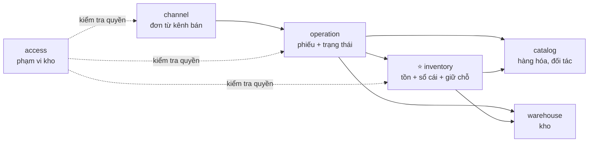

# Context map — Các module và cách chúng nói chuyện với nhau

> Tài liệu này giải thích **hệ thống v1 được chia thành những phần nào, mỗi phần chịu trách nhiệm gì, và chúng phối hợp ra sao**.
> Đọc xong, bạn phải trả lời được: "khi chuyển kho, phần nào gọi phần nào, và tồn kho được bảo vệ ở đâu?".

## Module là gì (giải thích cho người mới)

Có ba cách dựng một hệ thống:

| Cách | Hình dung | Ưu | Nhược |
|---|---|---|---|
| **Monolith thường** | Một văn phòng không vách ngăn: ai cũng lấy được giấy tờ của ai | Làm nhanh lúc đầu | Càng lớn càng rối; sửa chỗ này vỡ chỗ kia; không tách ra được |
| **Microservice** | Mỗi phòng ban là một công ty riêng, liên lạc qua bưu điện | Tách biệt, scale riêng từng phần | Rất nhiều việc vận hành; giao dịch qua nhiều "công ty" rất khó đúng |
| **Modular monolith** (v1 chọn) | Một văn phòng, **chia phòng có cửa**; muốn lấy giấy tờ phòng khác phải gõ cửa nhờ | Đơn giản như monolith, gọn gàng như microservice | Phải tự giữ kỷ luật (có test tự động canh giúp) |

**Module** = một "phòng" như vậy. Mỗi module:

- **Sở hữu riêng dữ liệu** của nó (trong PostgreSQL là một *schema* riêng). Không module nào được đọc/ghi thẳng bảng của module khác.
- **Mở một "cửa" công khai** (interface) để module khác nhờ việc. Mọi thứ bên trong cửa là chuyện riêng của module.
- Chạy chung một ứng dụng, chung một database, deploy một lần — nên vẫn đơn giản.

Ví dụ: khi nhân viên xác nhận phiếu xuất, module `operation` (phòng "phiếu") **không tự trừ bảng tồn**. Nó gõ cửa `inventory` (phòng "kho sổ") và nhờ: "giữ cho tôi 8 cái NCK-5L-DEN ở BN cho phiếu này". `inventory` tự kiểm tra, tự ghi sổ, rồi trả lời "được" hoặc "không đủ hàng, chỉ còn 2".

Vì sao phải khổ vậy? Vì **chỉ có một nơi duy nhất được đụng vào tồn kho**. Muốn chứng minh "tồn không bao giờ âm", ta chỉ cần soi một nơi đó. Và sang v2, khi tách `inventory` thành service riêng, ta chỉ cần thay "gõ cửa trong cùng văn phòng" bằng "gọi qua mạng" — phần còn lại giữ nguyên.

## 6 module

| Module | Sở hữu | Câu hỏi nghiệp vụ module này trả lời | Ràng buộc |
|---|---|---|---|
| `catalog` | Danh mục, sản phẩm, SKU, quy đổi đơn vị theo SKU, nhà cung cấp, khách hàng/đại lý | "Hàng này là gì, đóng gói thế nào, mua của ai, bán cho ai?" | Không phụ thuộc module nào (đứng đầu dòng) |
| `warehouse` | Kho | "Có những kho nào, ở đâu?" | Không phụ thuộc module nào |
| `inventory` ⭐ | Mức tồn, sổ cái biến động, giữ chỗ, khóa lệnh tồn, cảnh báo tồn thấp | "Còn bao nhiêu, ở kho nào, đang giữ cho ai, ai đã thay đổi và vì sao?" | **Không biết "phiếu" là gì** — chỉ nhận lệnh kèm tham chiếu phiếu |
| `operation` | Phiếu nhập, xuất, chuyển, kiểm kê + vòng đời trạng thái | "Phiếu này đang ở bước nào, ai được làm bước tiếp theo?" | Không sửa tồn trực tiếp; mọi thay đổi tồn đi qua cửa `InventoryApi` |
| `channel` | Danh sách kênh bán, kho được gán cho kênh, ánh xạ mã đơn bên ngoài | "Đơn này từ sàn nào, mã gốc là gì, đã nhận chưa?" | Chỉ dịch đơn ngoài thành phiếu xuất; không chứa logic tồn |
| `access` | Phạm vi kho của từng người dùng, hồ sơ người dùng tối thiểu | "Người này được thao tác những kho nào?" | Không lưu mật khẩu; đăng nhập và vai trò nằm ở Keycloak |

## Quan hệ giữa các module

Đọc mũi tên `A → B` là "**A nhờ B**", không bao giờ ngược lại:

- `channel → operation`: đơn Shopee đến, `channel` nhờ `operation` tạo và xác nhận một phiếu xuất.
- `operation → inventory`: phiếu đổi trạng thái, `operation` nhờ `inventory` giữ chỗ / trừ / cộng tồn.
- `operation → catalog`, `operation → warehouse`: khi tạo phiếu, kiểm tra SKU và kho có tồn tại, đang hoạt động.
- `inventory → catalog`, `inventory → warehouse`: khi ghi tồn, kiểm tra SKU và kho hợp lệ; lấy `minStock` để xét cảnh báo.
- `access ⇢ …`: trước mỗi thao tác, module hỏi `access` "người này có thuộc kho này không?".

Không có vòng tròn: `catalog` và `warehouse` không nhờ ai; `inventory` không bao giờ nhờ `operation`. Muốn báo ngược lên (ví dụ "tồn vừa xuống thấp"), module **phát sự kiện** (xem mục Domain events) chứ không gọi ngược.

## InventoryApi — cửa duy nhất vào tồn kho

Mọi thay đổi `onHand` / `reserved` đều phải đi qua 7 lệnh sau. Mỗi lệnh nhận **nhiều dòng một lúc** (một phiếu nhiều SKU) và **thành công hết hoặc không dòng nào** được ghi.

| Lệnh | Ai gọi (phiếu · bước) | Tác động lên tồn | Biến động ghi sổ | Khóa lệnh mẫu |
|---|---|---|---|---|
| `reserve` | Xuất · `confirm`; Chuyển · `confirm` (kho nguồn) | `reserved += q` | Không (`onHand` không đổi) | `OUTBOUND:{orderId}:RESERVE` |
| `release` | Xuất · `cancel`; Chuyển · `cancel` khi đã xác nhận | `reserved −= q` | Không | `OUTBOUND:{orderId}:RELEASE` |
| `commit` | Xuất · `complete` | `onHand −= picked`, `reserved −= requested` (phần lấy thiếu được nhả luôn trong cùng lệnh) | `OUTBOUND` | `OUTBOUND:{orderId}:COMMIT` |
| `receive` | Nhập · mỗi lần `receive` | `onHand += q` | `INBOUND` | `INBOUND:{receiptId}:RECEIVE` |
| `adjust` | Điều chỉnh tồn; Kiểm kê · `approve` | `onHand ± q` | `ADJUSTMENT` | `ADJUSTMENT:{adjustmentId}:ADJUST`, `STOCKTAKE:{stocktakeId}:ADJUST` |
| `transferOut` | Chuyển · `ship` (kho nguồn) | `onHand −= q`, `reserved −= q` | `TRANSFER_OUT` | `TRANSFER:{orderId}:TRANSFER_OUT` |
| `transferIn` | Chuyển · `receive` (kho đích); xử lý chênh lệch `FOUND` | `onHand += q` | `TRANSFER_IN` | `TRANSFER:{orderId}:TRANSFER_IN`, `TRANSFER:{resolutionId}:FOUND` |

Khóa lệnh nhập kho dùng `receiptId` (mỗi lần nhận một khóa) vì một phiếu nhập được nhận nhiều lần; còn các lệnh khác mỗi phiếu chỉ xảy ra một lần.

**Kết quả trả về** luôn là một giá trị, không phải lỗi văng ra: `OK`, `INSUFFICIENT_STOCK` (kèm danh sách dòng thiếu: SKU, cần bao nhiêu, còn bao nhiêu), hoặc `ALREADY_PROCESSED` (lệnh này đã chạy rồi — trả lại kết quả lần trước).

### Ví dụ đi qua các module: xác nhận phiếu xuất

1. Staff kho BN bấm "Xác nhận" phiếu `OUT-BN-…` (2 dòng).
2. `operation` hỏi `access`: staff này có thuộc kho BN? → có.
3. `operation` kiểm tra phiếu đang `DRAFT` → hợp lệ.
4. `operation` gọi `InventoryApi.reserve` với 2 dòng và khóa `OUTBOUND:{id}:RESERVE`.
5. `inventory` giữ chỗ từng dòng theo thứ tự SKU; dòng 2 không đủ → hủy cả hai, trả `INSUFFICIENT_STOCK` (dòng 2: cần 5, còn 2).
6. `operation` giữ phiếu ở `DRAFT`, báo lỗi rõ ràng cho staff.

Tất cả nằm trong **một giao dịch database** — hoặc mọi thứ được ghi, hoặc không gì cả.

## 5 luật ranh giới

Đây là kỷ luật để v1 đơn giản mà sang v2 vẫn tách được. Test tự động (`ApplicationModules.verify()`) canh cấu trúc phụ thuộc giữa các module; các luật còn lại canh bằng review và test nghiệp vụ.

| # | Luật | Nếu vi phạm thì sang v2 khổ thế nào |
|---|---|---|
| 1 | Một hành động người dùng = một giao dịch = **một** lệnh `InventoryApi` | Một hành động gọi nhiều lệnh rời rạc → khi tách service phải viết thêm cơ chế bù trừ cho từng tổ hợp |
| 2 | Mọi lệnh inventory có khóa lệnh, gửi lại không làm hai lần | Khi gọi qua mạng, việc gửi lại là chuyện thường → tồn bị trừ hai lần |
| 3 | Không khóa ngoại, không JOIN giữa các module; chỉ lưu ID | Khi tách database, mọi câu JOIN chéo phải viết lại, dữ liệu bị dính chặt |
| 4 | Kết quả nghiệp vụ trả về dạng giá trị, không văng lỗi nội bộ sang module khác | Lỗi nội bộ Java không đi qua mạng được → phải thiết kế lại toàn bộ cách báo lỗi |
| 5 | Việc phụ (cảnh báo, thông báo) đi qua sự kiện, không gọi trực tiếp | Gọi trực tiếp → module lõi phụ thuộc module phụ; phụ chết kéo lõi chết |

## Domain events

Sự kiện = thông báo "**một việc đã xảy ra**". Bên phát không cần biết ai nghe. Sự kiện được **lưu cùng giao dịch** với thay đổi nghiệp vụ, nên nếu ứng dụng chết giữa chừng thì sự kiện không bị mất — khởi động lại sẽ xử lý tiếp.

| Sự kiện | Ai phát | Phát khi nào | Dữ liệu chính | Ai nghe ở v1 |
|---|---|---|---|---|
| `StockReserved` | `inventory` | Lệnh `reserve` thành công | `skuId, warehouseId, qtyChange, referenceType, referenceId, occurredAt` | Cảnh báo tồn thấp |
| `StockReleased` | `inventory` | Lệnh `release` thành công | như trên | Cảnh báo tồn thấp |
| `StockCommitted` | `inventory` | Lệnh `commit` thành công | như trên | Cảnh báo tồn thấp |
| `StockReceived` | `inventory` | Lệnh `receive` thành công | như trên | Cảnh báo tồn thấp |
| `StockAdjusted` | `inventory` | Lệnh `adjust` thành công | như trên + `reasonCode` | Cảnh báo tồn thấp |
| `StockTransferredOut` | `inventory` | Lệnh `transferOut` thành công | như trên | Cảnh báo tồn thấp |
| `StockTransferredIn` | `inventory` | Lệnh `transferIn` thành công | như trên | Cảnh báo tồn thấp |
| `OrderStatusChanged` | `operation` | Phiếu bất kỳ đổi trạng thái | `orderType, orderId, fromStatus, toStatus, occurredAt` | Chưa có ở v1 (dành cho thông báo ở v2) |

Cảnh báo tồn thấp nghe **mọi** sự kiện `Stock*` vì tồn khả dụng có thể giảm (giữ chỗ, xuất, chuyển đi, điều chỉnh âm) — để **bật** cảnh báo — và có thể tăng (nhả giữ chỗ, nhập, nhận chuyển, điều chỉnh dương) — để **tắt** cảnh báo.

## Đường sang v2

- Tách `inventory` thành service riêng theo kiểu "thay dần" (strangler); `InventoryApi` đổi từ gọi trong ứng dụng thành gọi qua mạng; chuyển kho và xuất kho dùng Saga.
- Bật chế độ đẩy sự kiện ra Kafka cho các service khác nghe.
- App TMĐT thật (flash sale) gọi API của `channel`; thêm Redis cho SKU "nóng".
