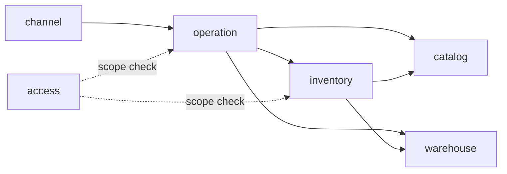

# Phase 0 — Thiết kế & chuẩn bị (Smart WMS v1)

- **Ngày:** 2026-09-30
- **Trạng thái:** Chờ review
- **Nguồn:** `overview.md` + phiên brainstorming ngày 2026-09-30
- **Phạm vi tài liệu:** mô tả *Phase 0 sẽ tạo ra gì* và *các quyết định thiết kế đã chốt* để các tài liệu Phase 0 bám theo. Tài liệu này là nguồn sự thật khi có mâu thuẫn với `overview.md`.

---

## 1. Mục tiêu & ràng buộc

**Mục tiêu (theo thứ tự ưu tiên ngang nhau):**
1. Giải một bài toán doanh nghiệp thật (persona ở mục 2).
2. Luyện xây một hệ thống từ A → Z **theo cách một team làm** (quy trình, tài liệu, review, sprint).
3. Hoàn thiện năng lực DevOps (các phase sau xây trên nền v1).

**Ràng buộc:**
- Làm một mình, ngoài giờ: ~2h/ngày thường, 5–6h/ngày cuối tuần ≈ **21h/tuần**.
- Không dùng Jira; chỉ dùng công cụ GitHub.
- Phase 0 **không viết code sản phẩm**. Output là tài liệu, sơ đồ, repo & quy trình.
- Thời lượng Phase 0: **2 tuần (~42h)**.

**Quyết định lớn đã chốt:**

| # | Quyết định | So với overview |
|---|---|---|
| D1 | v1 là **modular monolith** (Spring Modulith). Microservice, Saga, Kafka, Redis để v2 | Thay đổi |
| D2 | Nghiệp vụ v1: master data, nhập, xuất (reserve/release/commit), điều chỉnh, chuyển kho (in-transit), kiểm kê. Vị trí chỉ tới cấp **kho** | Thu gọn |
| D3 | Frontend **Next.js**, đầy đủ chức năng BE ngay trong v1 | Thay React SPA |
| D4 | Xác thực bằng **Keycloak (OIDC)**; RBAC + scope kho nằm trong app | Thay tự viết JWT |
| D5 | Persona giả định **VietHome Distribution** | Mới |
| D6 | v1 có **Channel Integration API** trung lập kênh; v2 xây app TMĐT thật (flash sale) gọi vào API này | Thay kết nối sàn thật |
| D7 | Phase 0 = thiết kế tinh gọn (sâu ở chỗ rủi ro, mỏng ở CRUD) + context map nhẹ kiểu DDD; walking skeleton là Sprint 1 của Phase 1 | Mới |

---

## 2. Persona: VietHome Distribution (giả định)

Công ty phân phối **đồ gia dụng & thiết bị nhà bếp** (nồi chiên không dầu, máy xay, bộ nồi, bình giữ nhiệt, đồ nhựa gia dụng).

- **Nguồn hàng:** ~40 nhà cung cấp/hãng.
- **Kênh bán:** sàn TMĐT (~60% đơn, đơn lẻ nhỏ) · ~200 đại lý (đơn theo thùng) · bán buôn dự án (đơn lớn, không đều).
- **Kho:** Bắc Ninh (kho tổng miền Bắc, lớn nhất), Đà Nẵng (nhỏ), Bình Dương (miền Nam).
- **Danh mục:** ~350 sản phẩm, ~1.500 SKU (biến thể màu/dung tích).
- **Nhân sự:** ~25 nhân viên kho, 3 quản lý kho, 2 kế toán, 1 admin IT.
- **Tải:** ~1.000 phiếu xuất/ngày; ngày sale đôi (9.9, 11.11, 12.12) gấp ~10 lần, dồn vào vài giờ.
- **Hiện trạng:** Excel + phần mềm bán hàng rời rạc.

| Nỗi đau | Phần hệ thống giải quyết |
|---|---|
| Bán vượt tồn ngày sale → hủy đơn, bị sàn phạt | Reserve/release + concurrency control |
| Tồn lệch thực tế, không biết lệch từ lúc nào, do ai | Stock ledger bất biến + audit |
| Hàng "biến mất" khi chuyển kho (2–3 ngày đường) | Chuyển kho có in-transit + xử lý chênh lệch |
| Hàng giá trị cao thất thoát, cuối tháng mới biết | Cycle count + điều chỉnh có lý do/người làm |
| Nhân viên kho này sửa nhầm tồn kho khác | RBAC + scope theo kho |

**Quy tắc nền suy ra:**
- Số lượng là **số nguyên**, lưu theo **đơn vị cơ sở** (cái).
- **Quy đổi ĐVT gắn theo SKU** (1 thùng bình giữ nhiệt = 24 cái; 1 thùng nồi chiên = 2 cái). Không dùng tỷ lệ toàn cục như `uoms.ratio_to_base` trong overview.
- Không quản lý lô/hạn dùng, không quản lý serial ở v1.

---

## 3. Phạm vi v1

**Làm:**
- Master data: category (cây), product, SKU, quy đổi ĐVT theo SKU, barcode, nhà cung cấp, khách hàng/đại lý, kho.
- Nhập kho, xuất kho, chuyển kho, kiểm kê (cycle count), điều chỉnh tồn — theo quy tắc mục 6.
- Xem tồn (on-hand / reserved / available) và lịch sử biến động.
- Cảnh báo tồn thấp (trong app) dựa trên `min_stock` của SKU.
- Channel Integration API (tạo / hủy phiếu xuất, xem available).
- Frontend Next.js cho toàn bộ chức năng trên.
- Phân quyền: Admin / Manager / Staff / Viewer / Channel client + scope kho.

**Không làm ở v1 (để v2 hoặc sau):**
- Vị trí zone/rack/bin; lô/hạn dùng/FEFO; serial.
- Kafka, Redis, microservice, Saga, gRPC.
- Kết nối API sàn thật; marketplace simulator; app TMĐT flash sale (v2).
- Dashboard realtime (WebSocket), email notification, Reporting read-model/CQRS.
- Kiểm kê toàn kho có khóa kho.
- Giá trị tồn kho / giá vốn.

---

## 4. Bộ tài liệu đầu ra của Phase 0

Docs-as-code: tài liệu nằm trong repo, thay đổi qua PR. Sơ đồ dùng **Mermaid** trong Markdown; 1–2 sơ đồ trưng bày (kiến trúc tổng) vẽ thêm bằng Excalidraw.

```
docs/
├── 00-vision-scope.md        # persona, nỗi đau, phạm vi v1 làm/không làm, tiêu chí thành công
├── 01-requirements/
│   ├── user-stories.md       # theo epic, mỗi story có AC Given/When/Then
│   └── nfr.md                # yêu cầu phi chức năng + SLO sơ bộ
├── 02-domain/
│   ├── glossary.md
│   ├── context-map.md        # 6 module + quan hệ + domain events
│   ├── business-rules.md     # bất biến tồn kho, quy tắc từng loại phiếu
│   ├── state-machines.md     # vòng đời 4 loại phiếu (Mermaid stateDiagram)
│   └── business-flows.md     # luồng nhập/xuất/chuyển/kiểm kê
├── 03-architecture/          # C4 level 1–2, cấu trúc module, sequence xuất kho + chuyển kho
├── 04-data/erd.md            # ERD theo module, sâu nhất ở inventory
├── 05-api/
│   ├── conventions.md        # lỗi, phân trang, idempotency, versioning
│   └── openapi.yaml          # đầy đủ: inventory, outbound, channel; khung cho phần còn lại
├── adr/                      # 0001 … 0009 (mục 9)
└── process/
    ├── workflow.md           # branch, commit, PR, DoR/DoD, sprint
    └── retros/               # sprint-N.md (bắt đầu từ Phase 1)
```

Ngoài `docs/`, Phase 0 còn tạo: `.github/` (issue template story/bug/task, PR template), GitHub Project board, labels, milestones, backlog Phase 1 dưới dạng issue.

**Lịch (~42h):**

| Tuần | Nội dung (theo thứ tự) |
|---|---|
| 1 — Hiểu bài toán | vision-scope → glossary → context-map → user-stories → business-rules → state-machines → business-flows |
| 2 — Thiết kế giải pháp | C4 + sequence → ERD → conventions + openapi → ADR → nfr → repo/board/labels/templates → backlog Phase 1 chia sprint |

**Tiêu chí hoàn thành Phase 0:**
- Mọi tài liệu trên đã merge vào `main` qua PR.
- Backlog Phase 1 tồn tại dưới dạng issue, đã gán sprint.
- Mọi story của Sprint 1–2 đạt Definition of Ready.

---

## 5. Kiến trúc module (modular monolith)

Một ứng dụng Spring Boot, một database PostgreSQL, **mỗi module sở hữu một schema riêng**.



| Module | Sở hữu | Ràng buộc |
|---|---|---|
| `catalog` | category, product, sku, sku_uom_conversion, supplier, customer | Upstream, không phụ thuộc module khác |
| `warehouse` | warehouse | Upstream, không phụ thuộc module khác |
| `inventory` | stock_levels, stock_movements, reservations, idempotency_keys | Không biết khái niệm "phiếu"; chỉ nhận `reference_type/id` |
| `operation` | inbound/outbound/transfer/stocktake orders + lines + state machine | Không sửa tồn trực tiếp; mọi thay đổi tồn qua `InventoryApi` |
| `channel` | ánh xạ Keycloak client ↔ kênh bán | Chuyển đơn ngoài thành phiếu xuất; không chứa logic tồn |
| `access` | user_warehouse_scope (theo `sub` Keycloak), hồ sơ user tối thiểu | Không lưu mật khẩu; user/role nằm ở Keycloak |

**5 luật ranh giới (chuẩn bị tách service ở v2):**
1. Một hành động người dùng = một transaction = **một** lệnh `InventoryApi` (batch nhiều dòng).
2. Mọi lệnh inventory idempotent theo key dạng `{REFERENCE_TYPE}:{referenceId}:{ACTION}`.
3. Không FK, không JOIN xuyên schema; chỉ lưu ID. Dữ liệu hiển thị lấy qua API module.
4. Kết quả nghiệp vụ trả về dạng giá trị (`INSUFFICIENT_STOCK`, `ALREADY_PROCESSED`), không ném exception nội bộ sang module khác.
5. Tác dụng phụ đi qua domain event, không gọi trực tiếp.

Ở v1 `operation` và `inventory` dùng chung transaction DB cục bộ. Ở v2 chỉ thay implementation `InventoryApi` bằng client từ xa + Saga.

**Domain events** (Spring Modulith + Event Publication Registry, đóng vai transactional outbox; v2 bật externalization sang Kafka):
`StockReceived`, `StockReserved`, `StockReleased`, `StockCommitted`, `StockAdjusted`, `StockTransferredOut`, `StockTransferredIn`, `OrderStatusChanged`.
Consumer v1 duy nhất: cảnh báo tồn thấp.

**Kiểm tra tự động:** `ApplicationModules.verify()` chạy trong CI.

---

## 6. Quy tắc nghiệp vụ

### 6.1. Lõi inventory

Đơn vị tồn: `(sku_id, warehouse_id)`, số nguyên theo đơn vị cơ sở. Hàng in-transit không thuộc `stock_levels` của kho nào; được tính từ phiếu chuyển.

| # | Bất biến | Bảo vệ bởi |
|---|---|---|
| I1 | `on_hand ≥ 0`, `reserved ≥ 0`, `reserved ≤ on_hand` | DB `CHECK` |
| I2 | Mỗi thay đổi `on_hand` sinh đúng một movement trong cùng transaction | Code + test |
| I3 | `Σ movements.qty_change = on_hand` với mọi `(sku, kho)` | Job đối soát hằng đêm + metric |
| I4 | `reserved = Σ reservations ACTIVE` | Bảng `reservations` + đối soát |
| I5 | Ledger append-only | `REVOKE UPDATE, DELETE` với user app + trigger chặn |

Sửa sai bằng movement bù, không sửa movement cũ.

**Movement types:** `INBOUND`, `OUTBOUND`, `TRANSFER_OUT`, `TRANSFER_IN`, `ADJUSTMENT`. (`reserved` thay đổi được ghi ở `reservations`, không sinh movement vì `on_hand` không đổi.)

**Concurrency:**
- Mặc định: **UPDATE có điều kiện nguyên tử**, ví dụ `UPDATE stock_levels SET reserved = reserved + :q WHERE sku_id = :s AND warehouse_id = :w AND on_hand - reserved >= :q`. 0 dòng cập nhật → `INSUFFICIENT_STOCK`.
- Phiếu nhiều dòng: xử lý theo thứ tự `sku_id` tăng dần (tránh deadlock), all-or-nothing.
- Chiến lược **optimistic (`version`)** và **pessimistic (`SELECT … FOR UPDATE`)** cài đặt song song, chọn bằng config, dùng cho test concurrency và k6 để so sánh số liệu.

**Idempotency:**
- Header `Idempotency-Key` bắt buộc cho mọi API thay đổi tồn và mọi API channel.
- Phạm vi key: `(principal, key)`; lưu `request_hash`, response, trạng thái; TTL 7 ngày.
- Cùng key + cùng payload → trả response cũ. Cùng key + khác payload → `409 IDEMPOTENCY_KEY_REUSED`. Request cũ đang chạy → `409 IDEMPOTENCY_IN_PROGRESS`.

### 6.2. Nhập kho

`DRAFT → CONFIRMED → RECEIVING → COMPLETED | CANCELLED`

- Staff tạo, xác nhận. Nhận hàng được nhiều lần một phần; mỗi lần nhận ghi `INBOUND` ngay.
- Không nhận vượt `expected_qty`; hàng dư tạo phiếu nhập bổ sung.
- Manager đóng phiếu (COMPLETED) kể cả khi thiếu; phần thiếu lưu `short_qty`.
- Chỉ hủy khi chưa nhận lần nào.

### 6.3. Xuất kho

`DRAFT → CONFIRMED → PICKING → COMPLETED | CANCELLED`

- **Reserve khi CONFIRM**, all-or-nothing. Thiếu → phiếu giữ DRAFT, lỗi liệt kê từng dòng thiếu.
- Phiếu từ channel: tạo + confirm trong một request.
- **Giữ chỗ quá hạn không tự hủy phiếu.** Job định kỳ đánh dấu phiếu CONFIRMED chưa sang PICKING quá 24h (channel) / 48h (tay) là "giữ chỗ quá hạn"; Manager xem trên dashboard, release/hủy hàng loạt. Ngưỡng cấu hình được.
- Short pick được phép: COMPLETE commit phần đã pick, release phần còn lại, bắt buộc lý do.
- Hủy từ CONFIRMED/PICKING → release toàn bộ.

### 6.4. Chuyển kho

`DRAFT → CONFIRMED → IN_TRANSIT → RECEIVED | DISCREPANCY → CLOSED`, và `DRAFT | CONFIRMED → CANCELLED`

- **CONFIRM:** reserve ở kho nguồn.
- **SHIP → IN_TRANSIT:** commit ở kho nguồn, ghi `TRANSFER_OUT`.
- **RECEIVE:** staff thuộc scope **kho đích** nhập `received_qty ≤ shipped_qty` mỗi dòng; ghi `TRANSFER_IN`. Đủ hết → `RECEIVED`; thiếu → `DISCREPANCY`.
- **Xử lý chênh lệch** (Manager, từng dòng): `WRITE_OFF` (mất, ghi bên chịu trách nhiệm: nhà vận chuyển / kho nguồn / kho đích) hoặc `FOUND` (nhận bổ sung vào kho đích, ghi `TRANSFER_IN`). Hết dòng chênh lệch → `CLOSED`.
- Không nhận vượt số đã xuất. Hủy chỉ trước SHIP; sau SHIP phải tạo phiếu chuyển ngược.

### 6.5. Kiểm kê (cycle count)

`DRAFT → COUNTING → REVIEW → ADJUSTED | CANCELLED`

- Phạm vi: cả kho hoặc danh sách SKU. **Không khóa kho.**
- **Blind count:** staff không thấy số hệ thống.
- Khi nhập số đếm cho một dòng, hệ thống chụp `system_qty` tại thời điểm đó. Khi điều chỉnh, áp **chênh lệch** `counted − system_qty_lúc_đếm`, không ghi đè tuyệt đối.
- Ở REVIEW, Manager có thể yêu cầu **đếm lại** từng dòng (ưu tiên staff khác); dòng đó về COUNTING, dòng khác giữ nguyên. Phiếu chỉ sang REVIEW khi mọi dòng đã có số đếm.
- Manager duyệt → sinh `ADJUSTMENT` cho các dòng lệch → ADJUSTED. Điều chỉnh âm làm `on_hand < reserved` bị chặn; phải xử lý phiếu đang giữ chỗ trước.

### 6.6. Điều chỉnh tồn

- Chỉ Manager trở lên. Mã lý do bắt buộc: `DAMAGED`, `LOST`, `FOUND`, `COUNT_CORRECTION`, `OTHER` (kèm ghi chú).
- Mỗi điều chỉnh = một movement `ADJUSTMENT` với người làm + lý do.

### 6.7. Phân quyền

Role là realm role trong Keycloak; scope kho nằm ở module `access`.

| | Admin | Manager | Staff | Viewer | Channel client |
|---|---|---|---|---|---|
| Master data | Ghi | Xem | Xem | Xem | — |
| Tạo / thực hiện phiếu | Tất cả kho | Kho mình | Kho mình | — | Chỉ tạo/hủy phiếu xuất |
| Đóng phiếu, duyệt kiểm kê, xử lý chênh lệch, điều chỉnh | Tất cả kho | Kho mình | — | — | — |
| Xem tồn & ledger | Tất cả | Kho mình | Kho mình | Tất cả | Chỉ available |
| Quản lý user / scope | Có | — | — | — | — |

Channel client xác thực bằng Keycloak client credentials; mỗi kênh một client (`channel-shopee`, `channel-tiktok`, …) và được gán kho xuất hàng.

---

## 7. Kỹ thuật, dữ liệu & quy ước API

**Tech stack v1:**

| Lớp | Lựa chọn |
|---|---|
| Backend | Java 21, Spring Boot 3, Spring Modulith, Spring Data JPA (+ native query cho UPDATE có điều kiện), Flyway (thư mục migration theo module) |
| DB | PostgreSQL 16 (idempotency cũng lưu ở PG) |
| Auth | Keycloak, realm-as-code (JSON import) |
| Frontend | Next.js (App Router) + TypeScript, Auth.js, orval (client + TanStack Query sinh từ OpenAPI), shadcn/ui hoặc Ant Design (chốt trong ADR ở Sprint 1) |
| Test | JUnit 5, Testcontainers, Modulith verify, test concurrency, Playwright cho luồng E2E chính |
| Local | docker-compose: api, web, postgres, keycloak |

**Repo:** monorepo — `apps/api`, `apps/web`, `docs/`, `deploy/` (từ Phase 2), `.github/`, `docker-compose.yml`. CI lọc theo path.

**Contract-first:** `docs/05-api/openapi.yaml` là nguồn gốc. BE sinh interface bằng openapi-generator (`interfaceOnly`) rồi implement; FE sinh client bằng orval. Lệch contract → lỗi biên dịch; CI kiểm tra file sinh ra không bị lệch.

**Quy ước dữ liệu:**
- ID: UUIDv7. Mã phiếu dễ đọc: `{LOẠI}-{KHO}-{YYMMDD}-{SEQ}`, ví dụ `OUT-BN-260930-0001`.
- Mọi bảng: `created_at`, `created_by`, `updated_at`, `updated_by`. Lưu UTC; UI hiển thị `Asia/Ho_Chi_Minh`.
- Bảng phiếu có `version`; sửa phiếu yêu cầu header `If-Match`.
- Inventory bổ sung bảng `reservations(id, sku_id, warehouse_id, qty, reference_type, reference_id, reference_line_id, status ACTIVE|COMMITTED|RELEASED, created_at, updated_at)` so với overview.
- Catalog dùng `sku_uom_conversions(sku_id, uom_code, qty_in_base)` thay cho `uoms.ratio_to_base`.

**Quy ước API:**
- Prefix `/api/v1`. Hành động là sub-resource: `POST /outbound-orders/{id}/confirm`.
- Lỗi theo RFC 9457 Problem Details + trường `code` nghiệp vụ (`INSUFFICIENT_STOCK`, `INVALID_STATE_TRANSITION`, `WAREHOUSE_SCOPE_DENIED`, `VERSION_CONFLICT`, `IDEMPOTENCY_KEY_REUSED`, …). `INSUFFICIENT_STOCK` kèm danh sách dòng thiếu.
- Phân trang `page`, `size`, `sort`; filter qua query param thống nhất.
- Mọi response có `X-Correlation-Id`.
- Channel API tối thiểu: `POST /api/v1/channel/orders`, `POST /api/v1/channel/orders/{id}/cancel`, `GET /api/v1/channel/orders/{id}`, `GET /api/v1/channel/availability?sku=`.

---

## 8. Quy trình làm việc kiểu team

**Công cụ GitHub:**
- Issue = story / task / bug / spike, có template (story bắt buộc AC Given/When/Then).
- Project board: `Backlog → Ready → In Progress → In Review → Done`; trường **Iteration** = sprint 2 tuần.
- Milestone = Phase. Labels: `type:story|bug|chore|spike`, `module:<tên>`, `priority:P0|P1|P2`.

**Code flow:**
- Trunk-based; `main` được bảo vệ; branch `feat|fix|chore/<issue>-<slug>`, sống ≤ 2–3 ngày.
- Mỗi issue một PR, có `Closes #N`, CI xanh mới merge, squash merge.
- Conventional Commits (kiểm tra tên PR trong CI). release-please sinh CHANGELOG và tag `v0.x` cuối sprint; `v1.0.0` khi hết Phase 1.
- Review: tự review vào hôm sau + AI review. PR template có checklist: test, OpenAPI, migration, ADR.

**Nghi thức sprint** (năng lực ~42h, lên kế hoạch ~30h):

| Nghi thức | Cách làm | Thời lượng |
|---|---|---|
| Planning | Thứ 7 đầu sprint: kéo story đạt DoR, ước lượng giờ | 1h |
| Daily | Comment 3 dòng vào issue đang làm: xong gì / tiếp theo / vướng gì | 5' |
| Review | Video demo 3–5 phút | 30' |
| Retro | `docs/process/retros/sprint-N.md`: giữ / bỏ / thử + so ước lượng với thực tế | 30' |

**Definition of Ready:** có AC; endpoint đã có trong OpenAPI; bảng đã có trong ERD; vừa một sprint.
**Definition of Done:** code + unit/integration test; CI xanh; OpenAPI/docs cập nhật; dùng được trên FE; đã merge; issue đóng.

---

## 9. ADR viết trong Phase 0

| ADR | Chủ đề |
|---|---|
| 0001 | Modular monolith cho v1, lộ trình tách service ở v2 |
| 0002 | Keycloak (OIDC) cho xác thực |
| 0003 | 5 luật ranh giới `InventoryApi` |
| 0004 | Chiến lược concurrency mặc định: UPDATE có điều kiện nguyên tử |
| 0005 | Lưu idempotency key trên PostgreSQL |
| 0006 | Contract-first với OpenAPI + sinh code hai phía |
| 0007 | Spring Modulith events làm transactional outbox |
| 0008 | Monorepo + trunk-based development |
| 0009 | UUIDv7 làm khóa chính |

---

## 10. Backlog Phase 1 (6 sprint × 2 tuần ≈ 12 tuần)

| Sprint | Mục tiêu | Demo |
|---|---|---|
| S1 | Walking skeleton: monorepo, Spring Boot + Next.js + Keycloak + PG trên docker-compose; CI (build, test, lint, OpenAPI drift, Modulith verify); Problem Details; correlation ID | Đăng nhập end-to-end, CI xanh |
| S2 | Access (scope kho), Catalog (SKU, quy đổi ĐVT), Warehouse — BE + FE | Quản lý master data theo quyền |
| S3 | Inventory core: stock level, ledger, idempotency, 3 chiến lược concurrency + test concurrency; phiếu nhập | Nhập hàng, xem tồn + lịch sử |
| S4 | Phiếu xuất (reserve/commit/release, short pick), job giữ chỗ quá hạn, Channel API | Hai người xuất cùng lúc không âm tồn |
| S5 | Chuyển kho (+ chênh lệch), điều chỉnh, event cảnh báo tồn thấp | Chuyển BN → ĐN, nhận thiếu, xử lý |
| S6 | Kiểm kê (đếm lại), job đối soát ledger, E2E Playwright, hoàn thiện | Tag `v1.0.0`, video demo |

Ghi chú: overview ước Phase 1 4–6 tuần; với FE đầy đủ và ~21h/tuần, 12 tuần là con số thực tế. Các phase DevOps sau (2–8) giữ như overview, nhưng CI và Docker đã có từ S1.

---

## 11. Định hướng v2 (chỉ để các quyết định v1 không chặn đường)

- Tách `inventory` thành service riêng (strangler); `InventoryApi` thành client từ xa; chuyển kho và xuất kho dùng Saga orchestration.
- Bật externalization event của Spring Modulith sang Kafka.
- App TMĐT thật (flash sale) gọi Channel API; Redis cho hot SKU.
- Vị trí zone/rack/bin, serial cho hàng bảo hành, dashboard realtime, Reporting read-model.
